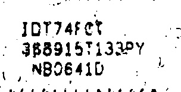

# windows_cleaner_image
The explanation of the project's application is that the image is divided into separate and small areas with steps (x_step, y_step). Now, if there is text in any window, the number of black pixels compared to total pixels (assuming that the background is white) must be greater than a value (which we have specified as an input called "text_pixel_ratio") so that window should be Recognized as a window with text and it will not be cleaned. 
In addition, the next idea is that if the number of black pixels on the white background of the image is greater than a limit (which we specified with the name "symbol_pixel_ratio") in this case, that window will be identified as the window containing the symbol and will be deleted. 
It should be mentioned that the third idea implemented in this coding is that the input parameter called "crop_around" is defined, and when it is active, the final step in the windows of the x and y axes will always be cleared. 
## run: main.py

## application:
Clearing windows with very low and very high pixel density

## adjustable parameters:
text_pixel_ratio to total pixels is defined as input parameter and has defualt value equal to 10%  
symbol_pixel_ratio to total pixels is defined as input parameter and has defualt value equal to 60%  
this code is generaly written for all black or white background which can de adjusted using "is_background_white" input parameter and has defualt value equal to True  
you can decide to don't crop around pixels using set "crop_around" parameter to False. 
## example:
here is some examples: 
### example 1:
<kbd>original image is:   
cleaned image is:   
